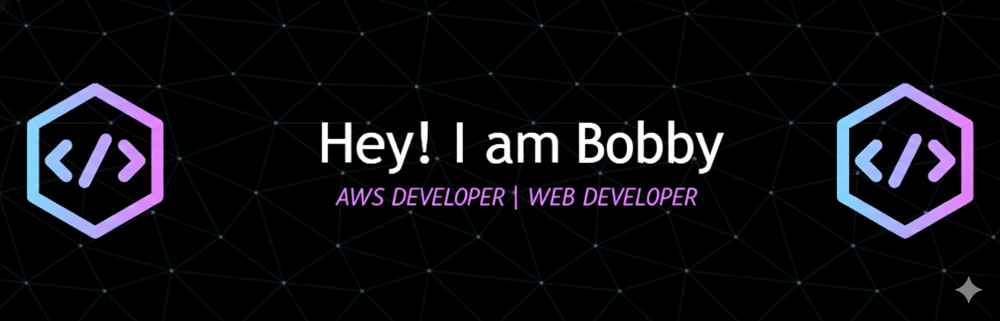

<!DOCTYPE html>
<html lang="en">
<head>
    
  <meta charset="UTF-8">
  <meta name="viewport" content="width=device-width, initial-scale=1.0">
  <link href="https://fonts.googleapis.com/css2?family=Poppins:wght@300;400;600&display=swap" rel="stylesheet">
</head>
<body>
  

  

    
    
    
  

  

  

    <h3 class="section-title">👨‍💻 About Me</h3>
    <ul>
      <li>👯 <em>Collaboration:</em> Real-time web and cloud projects with AWS or React.</li>
      <li>🤝 <em>Need help with:</em> Scalable cloud designs and IoT integration.</li>
      <li>🌱 <em>Learning:</em> AWS Architecture, GraphQL, and Machine Learning.</li>
      <li>💬 <em>Ask me about:</em> AWS, C++, Java, or DSA.</li>
      <li>⚡ <em>Fun fact:</em> Solved 600+ DSA problems!</li>
      <li>📫 <em>Reach me:</em> <a href="mailto:bobbyd9676@gmail.com">Email</a> or <a href="https://www.linkedin.com/in/bobbydevarapu/">LinkedIn</a></li>
    </ul>
  

  

  

    <h3 class="section-title">🌐 Connect with Me</h3>
    

      
      
      
      
      
      
      
    

  

  

  

    <h3 class="section-title">🛠 Languages and Tools</h3>
    

      
      
      
      
      
      
      
      
      
      
      
      
      
      
    

  

  

  

    <h3 class="section-title">🌟 Experience</h3>
    <ul>
      <li>
        <strong>AWS Development Intern</strong> 
        Technical Hub Pvt. Ltd – AWS Developer 
        Kakinada, Andhra Pradesh 
        May 2025 – July 2025 
        Surampalem, Andhra Pradesh 
        <a href="https://github.com/bobbydevarapu/">GitHub</a> 
        • Deployed and monitored AWS infrastructure (EC2, S3, IAM, CloudWatch) for 5+ applications in test environments. 
        • Created Python/Bash automation scripts that streamlined cloud configuration tasks by 25%. 
        • Monitored system metrics and streamlined performance checks, enhancing stability while lowering repetitive interventions by 15%. 
        • Connected backend services to cloud resources via REST APIs and tracked application-level behavior. 
      </li>
      <li>
        <strong>Generative AI Intern</strong> 
        SmartBridge Educational Services Pvt. Ltd – Gen AI Intern 
        June 2025 – July 2025 
        Remote, Andhra Pradesh 
        <a href="https://github.com/bobbydevarapu/">GitHub</a> 
        • Completed a Generative AI internship on IBM Cloud, delivering 100% of milestones on schedule. 
        • Processed and evaluated 12+ datasets to support preprocessing and improve baseline model testing accuracy by 18%. 
        • Constructed optimized data-preprocessing pipelines using Python, boosting stability and minimizing manual effort. 
      </li>
    </ul>
  

  

  

    <h3 class="section-title">🚀 Projects</h3>
    

      

        
        <strong>Real-Time Stock Market Analytics Pipeline</strong> 
        AWS Cloud, Python, Kinesis 
        <a href="https://github.com/bobbydevarapu/real-time-stock-analytics-aws">Project Link</a>
        <ul>
          <li>Architected a serverless real-time data pipeline using Kinesis, Lambda, and DynamoDB to ingest and process events.</li>
          <li>Applied anomaly detection logic in Lambda with SNS alerts for price spikes and logged insights to S3.</li>
          <li>Configured CloudWatch dashboards that improved monitoring accuracy and cut manual data analysis time by 85%.</li>
          <li>Exposed processed data through REST endpoints for downstream applications and monitoring tools.</li>
        </ul>
      

      

        
        <strong>Automated Receipt Processing System</strong> 
        AWS S3, Textract, Lambda, SES 
        <a href="https://github.com/bobbydevarapu/automated_receipt_processing">Project Link</a>
        <ul>
          <li>Designed a Textract-based OCR workflow with automated ingestion and structured DynamoDB storage.</li>
          <li>Developed Lambda-based validation and transformation pipelines with retries and fault-tolerant execution.</li>
          <li>Enabled SES-based scheduled reporting, reducing manual expense tracking by 80% through end-to-end automation.</li>
        </ul>
      

      

        
        <strong>Intelligent Incident Recovery System</strong> 
        Python/Java, AWS Lambda, DynamoDB 
        <a href="https://github.com/bobbydevarapu/Intelligent_incident_system">Project Link</a>
        <ul>
          <li>Engineered an automated log-classification pipeline processing 2,000+ events/day across distributed services.</li>
          <li>Implemented restart, cleanup, and scaling workflows that accelerated issue resolution by 80%.</li>
          <li>Automated incident triage and alerting workflows, improving response efficiency across distributed systems.</li>
        </ul>
      

    

  

  

  

    <h3 class="section-title">🏆 Achievements & Certifications</h3>
    <ul>
      <li><strong>Achievements:</strong> 
        • Participated in 30+ hackathons across GFG and Unstop platforms. 
        • Achieved a 3-Star CodeChef rating and 1400+ LeetCode rating by solving 600+ DSA problems. 
        • Maintained active competitive programming profiles across LeetCode, CodeChef, GFG, and HackerRank. 
      </li>
      <li><strong>Certifications:</strong> 
        • AWS Certified Developer – Associate 
        • Java IT Specialist (Pearson) 
        • Red Hat Certified System Administrator (RHCSA) 
        • Cisco CCNA v7 – Introduction to Networks 
      </li>
    </ul>
  

  

  

</body>
</html>
