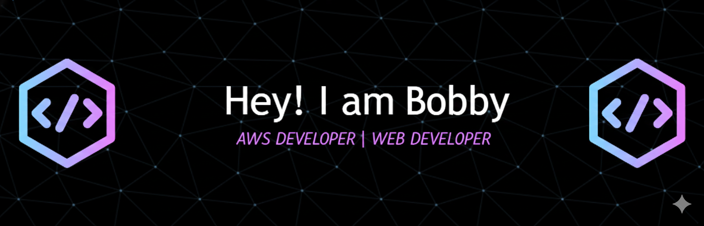

<!DOCTYPE html>
<html lang="en">
<head>
    
  <meta charset="UTF-8">
  <meta name="viewport" content="width=device-width, initial-scale=1.0">
  <link href="https://fonts.googleapis.com/css2?family=Poppins:wght@300;400;600&display=swap" rel="stylesheet">

<meta charset="UTF-8">
<meta name="viewport" content="width=device-width, initial-scale=1.0">

### Backend Engineer • AWS Developer • AI Enthusiast

Building scalable backend systems, cloud-native applications,
and AI-powered platforms.

</head>
<body>
  

<!-- ABOUT ME -->

  <h2 align="center">
    👨‍💻 Bobby Devarapu
  </h2>

  <h4 align="center">
    Backend Engineer • AWS Developer • AI Enthusiast
  </h4>

  

    Building scalable backend systems, cloud-native applications,
    and AI-powered platforms with modern technologies.
  

   

  <ul>
    <li>
      🚀 Currently focused on 
      <strong>Backend Engineering, AWS Cloud, and AI Systems</strong>
    </li>

    <li>
      🧠 Solved 
      <strong>600+ DSA problems</strong> across LeetCode, CodeChef, and HackerRank
    </li>

    <li>
      ⚙️ Working with 
      <strong>Java, Spring Boot, Python, FastAPI, React, MongoDB, AWS</strong>
    </li>

    <li>
      📚 Exploring 
      <strong>System Design, Microservices, Event-Driven Architecture, and Generative AI</strong>
    </li>

    <li>
      🏆 AWS Certified Developer Associate • RHCSA • CCNA
    </li>

    <li>
      📫 Reach me:
      <a href="mailto:bobbyd9676@gmail.com">Email</a> •
      <a href="https://www.linkedin.com/in/bobbydevarapu/">LinkedIn</a>
    </li>
  </ul>

  

<!-- CONNECT WITH ME -->

  <h3 class="section-title">🌐 Connect with Me</h3>

  

    
    &nbsp;&nbsp;&nbsp;

    
    &nbsp;&nbsp;&nbsp;

    
    &nbsp;&nbsp;&nbsp;

    
    &nbsp;&nbsp;&nbsp;

    
    &nbsp;&nbsp;&nbsp;

    
    &nbsp;&nbsp;&nbsp;

    
  

<!-- LANGUAGES & TOOLS -->

  <h3 class="section-title">🛠 Languages and Tools</h3>

  

    
    &nbsp;

    
    &nbsp;

    
    &nbsp;

    
    &nbsp;

    
    &nbsp;

    
    &nbsp;

    
    &nbsp;

    
    &nbsp;

    
    &nbsp;

    
    &nbsp;

    
    &nbsp;

    
    &nbsp;

    
    &nbsp;

    

  

  

<!-- EXPERIENCE SECTION -->

  <h3 class="section-title">🌟 Experience</h3>

  <ul>
    <li>
      <strong>AWS Development Intern</strong> 
      Technical Hub Pvt. Ltd – AWS Developer 
      📍 Surampalem, Andhra Pradesh 
      📅 June 2024 – June 2025  

      • Managed AWS infrastructure including EC2, S3, IAM, and CloudWatch for multiple applications. 
      • Automated Linux environment setup using Python and Bash scripts. 
      • Implemented monitoring workflows and infrastructure automation. 
    </li>

     

    <li>
      <strong>Generative AI Intern</strong> 
      SmartBridge Educational Services Pvt. Ltd – Gen AI Intern 
      📍 Remote 
      📅 May 2025 – July 2025  

      • Built Python-based preprocessing pipelines on IBM Cloud. 
      • Improved baseline AI model performance through optimized dataset validation. 
      • Developed reusable workflows for scalable preprocessing systems. 
    </li>
  </ul>

<!-- PROJECTS SECTION -->

  <h3 class="section-title">🚀 Featured Projects</h3>

  

    <!-- PROJECT 1 -->

    

      <strong>Assignment Integrity Analyzer</strong> 

      
        Python • FastAPI • MongoDB • Sentence Transformers
        

      Embedding-based plagiarism detection system for copied and paraphrased assignment analysis.  

      <a href="https://github.com/bobbydevarapu/Analyzer-101">
        GitHub Repository
      </a> 

      <a href="https://aia-101.up.railway.app/">
        Live Demo
      </a>
    

    <!-- PROJECT 2 -->

    

      <strong>Multi-Modal AI Summarization System</strong> 

      
        Python • Whisper • OCR • NLP • Transformers
        

      AI-powered platform for summarizing documents, speech, images, and videos with intelligent query answering.
    

    <!-- PROJECT 3 -->

    

      <strong>Automated Expense Processing System</strong> 

      
        AWS Textract • Lambda • S3 • DynamoDB
        

      Serverless OCR pipeline for automated receipt extraction and reporting workflows.  

      <a href="https://github.com/bobbydevarapu/automated_receipt_processing">
        GitHub Repository
      </a>
    

    <!-- PROJECT 4 -->

    

      <strong>Box Dome</strong> 

      
        React • Node.js • MongoDB • Tailwind CSS
        

      Full-stack movie tracking platform with authentication, watchlists, and responsive UI.  

      <a href="https://github.com/bobbydevarapu/boxdome-app">
        GitHub Repository
      </a> 

      <a href="https://boxdome-app.onrender.com">
        Live Demo
      </a>
    

    <!-- PROJECT 5 -->

    

      <strong>Feature Flag Engine</strong> 

      
        Java • Spring Boot • Redis • MySQL
        

      Runtime feature management system supporting controlled rollouts and backend optimization.  

      <a href="https://github.com/bobbydevarapu/featureengine">
        GitHub Repository
      </a>
    

    <!-- PROJECT 6 -->

    

      <strong>Real-Time Stock Market Analytics</strong> 

      
        AWS • Spring Boot • REST APIs • React
        

      Event-driven stock analytics platform with real-time market tracking and streaming workflows.  

      <a href="https://github.com/bobbydevarapu/real-time-stock-analytics-aws">
        GitHub Repository
      </a>
    

  

  

  

    <h3 class="section-title">🏆 Achievements & Certifications</h3>
    <ul>
      <li><strong>Achievements:</strong> 
        • Participated in 30+ hackathons across GFG and Unstop platforms. 
        • Achieved a 3-Star CodeChef rating and 1400+ LeetCode rating by solving 600+ DSA problems. 
        • Maintained active competitive programming profiles across LeetCode, CodeChef, GFG, and HackerRank. 
      </li>
      <li><strong>Certifications:</strong> 
        • AWS Certified Developer – Associate 
        • Java IT Specialist (Pearson) 
        • Red Hat Certified System Administrator (RHCSA) 
        • Cisco CCNA v7 – Introduction to Networks 
      </li>
    </ul>
  

  

  

</body>
</html>
